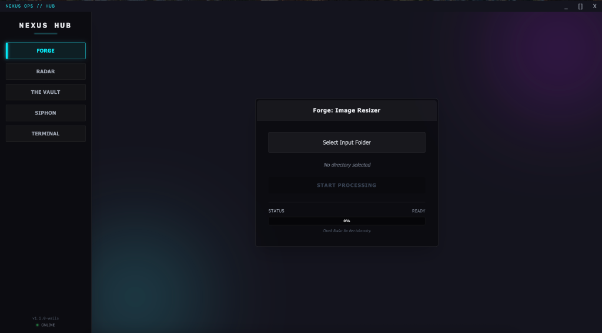

# Nexus Ops (Wails Edition)

## 🚀 Nexus Hub - Cyberpunk Command Center

**Nexus Ops** is een moderne desktop applicatie, herbouwd met **Wails** (Go + React + TailwindCSS).
Het combineert de brute kracht van Go's concurrency met de visuele elegantie van moderne webtechnologie en Glassmorphism.



## ✨ Highlights (Wails Upgrade)

### 🎨 Modern UI (React + Tailwind)
-   **Glassmorphism**: Prachtige transparantie en `backdrop-blur` effecten (geoptimaliseerd voor Mac/Windows).
-   **Frameless Window**: Een custom Cyberpunk titlebar voor een echte desktop ervaring.
-   **Event-Driven Telemetry**: Real-time updates via het Wails event systeem (geen polling nodig).

### 🛠 Core Modules
-   **Forge**: Geavanceerde Image Processing met streaming progress.
    -   *Non-blocking UI*: Scan en verwerk duizenden bestanden zonder haperingen in de interface.
-   **Radar**: Live monitoring van alle systeemtaken met kleurgecodeerde badges en real-time duur tracking.
-   **Cyber Sidebar**: Snelle navigatie tussen Forge, Radar en toekomstige modules zoals Vault, Siphon en Terminal.

## 🚀 Snel Starten

Vereisten: Go 1.20+, Node 18+

1.  **Installeer Wails CLI**:
    ```bash
    go install github.com/wailsapp/wails/v2/cmd/wails@latest
    ```

2.  **Start Development Mode**:
    ```bash
    wails dev
    ```
    *Met hot-reload voor zowel Go als React wijzigingen.*

3.  **Bouw voor Productie**:
    ```bash
    wails build
    ```
    *De binary verschijnt direct in `build/bin/`.*

## 🏗 Architectuur

-   `main.go`: Applicatie entry point & venster configuratie.
-   `app.go`: De bridge die Go functies en events blootstelt aan de frontend.
-   `internal/sys`: Beheert de wereldwijde state, metrics en taakbeheer (Go).
-   `internal/forge`: High-performance worker pools voor beeldverwerking (Go).
-   `frontend/`: Moderne React applicatie met TailwindCSS v3 styling.

---
*Nexus Ops: Kracht ontmoet Esthetiek.*
